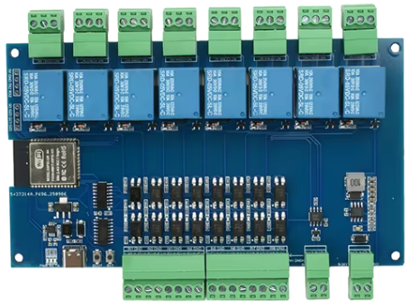

# ESP32_Relay_X8_module
This repository contains custom firmware for chinese esp32 relay module\
\
Marking on the bottom side of the PCB: **ESP32_Relay_X8_Modbus (303E32DC812)**
The module can be found as "ESP32 RS485 Modbus Wifi Bluetooth Relay Optocoupler Isolation Module Type C 4/8 Channel Relay Module DC 9-24V".\
I ordered mine from [Aliexpress](https://www.aliexpress.com/item/1005010518108874.html).

This repository is focused to the 8-channel version of that product. I don't own the 4-channel version so I cannot verify validity of here published informations for that version.

## Project goals
 - [x] Basic I/O control via Modbus RTU
 - [x] Add Modbus configuration parameters (modbus address, baudrate,...)
 - [ ] Allow the Input-Output tie to be optional
 - [ ] Use the pins on JP1 for 1Wire sensors
 - [ ] WiFi - on demand AP/Client enable for Firmware OTA upgrades\
       Should be enabled/disabled via Modbus or physical inputs.

## In this repository:
 * [Base firmware](/ESP32_Relay_X8_module) with MODBUS RTU, changeable address and RS485 communication parameter settings (baudrate up to 921600) and config reset functionality
      
## Status on arival:
The module works as Modbus Slave with slave ID=1. According to all sources I managed to gather, this looks to be hardcoded. The bus connection parameters are also hardcoded.
No visible SSID and no new Wireless channel was identified - WiFi on the ESP32 is probably off.

```
Modbus ID: 1
Bus parameters: 115200 8N1
```

The inputs 1-8 are software-tied to the relays.
Working Modbus functions:
 - 01 - Read coils [0-7] bool
 - 02 - ReadDiscreteInputs [0-7] bool
 - 05 - WriteSingleCoil [0-7] bool
 - 15 - WriteMultipleCoils Address 0, count 8, number 0x00-0xFF

For easy function check, you can use the [ModbusTools dataView definition file](files/esp32_Relay_x8_modbus_default_view.xml)

## Schematics
I managed to get this schematics file [ESP32_Relay_X8_Modbus_303E32DC812.pdf](files/ESP32_Relay_X8_Modbus_303E32DC812.pdf) , not sure about author & license. If this somehow offend authors rights, please contact me and I can remove that document. 
- The power supply is based on the [TPS54331](https://www.ti.com/lit/ds/symlink/tps54331.pdf) so it could be capable to work up to 28V. The declared 24V seems to be a safe option. It contains a diode as reverse-voltage connection.
- The RS485 is connected to UART1 of the ESP32 via [SP3485-EN-L](https://www.maxlinear.com/product/interface/serial-transceivers/rs-485-rs-422/sp3485) without galvanic isolation. Please note that this is a non-isolated design; ensure all connected devices share a common reference ground to prevent hardware failure.
- A and B channel of the RS485 is protected against overvoltage via TVS 
- Inputs are optocoupler-isolated and connected via 74HC165D
- Outputs are connected via 74HC595, also optocoupler-isolated
- Switching relay is SRD-05VDC-SL-G, this draws about 70mA when enabled - so just the 8 relays could draw about 560mA. The power supply should be able to serve up to 3A so there is quite a reserve even with the ESP32 current draw.

## Links
 - The same module via [MODBUS TCP](https://github.com/multigcs/esp32_relay_x8_modbus_303e32dc812)

## Tools
 - [ModbusTools](https://github.com/serhmarch/ModbusTools) by Serhii Marchuk - Multi-platform MODBUS client/server
 - [modbus-esp8266](https://github.com/emelianov/modbus-esp8266) library for the Arduino IDE
